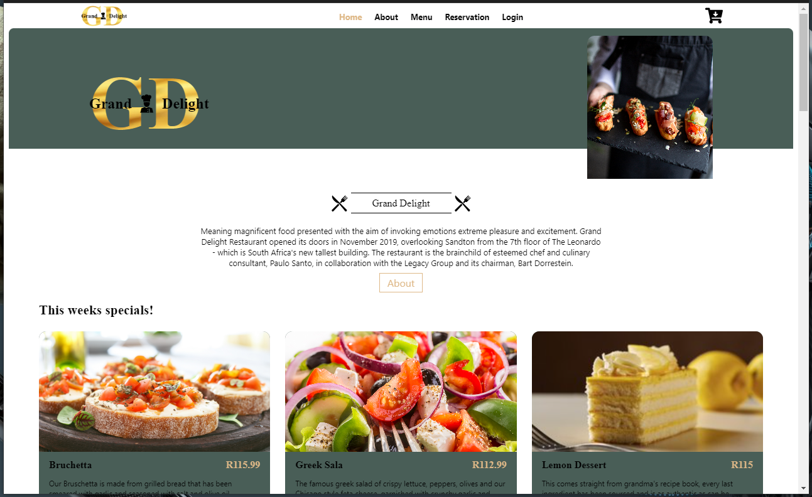

---

The Grand Delight is a South African owned restaurant. I built this website as a solution to provide a platform for customers to make reservations and also order food online. Most if not all high end restaurant do not provide the option of ordering food online, I have been in conversations with many people and they all thought it would be a good idea and benefit for both the restaurant and customers. The web app uses stripe for payments and also uses Querying API for live data and local data storage.

## Programming Languages, frameworks and/or tools used
React, CSS, Email.js, Stripe 

## Instructions and Usage

The Grand Delight website is an online based web app that can be accessed from the web, hence it does not require any download. Customers can browse the menu, make reservations and also order online.

## Key Features

- Ability to make reservations.
- Automated reservation email confirmation containing reservation details.
- Stripe payment processing.
- local data storage API.
- Order online.
